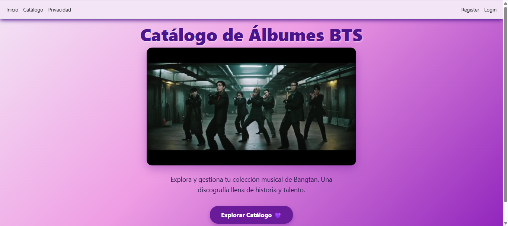
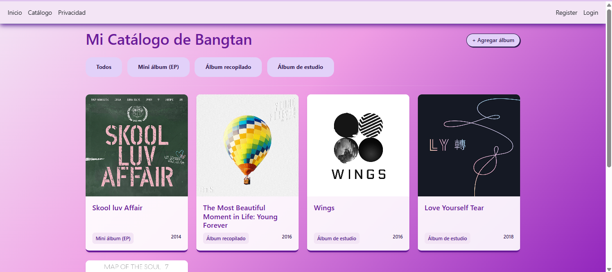
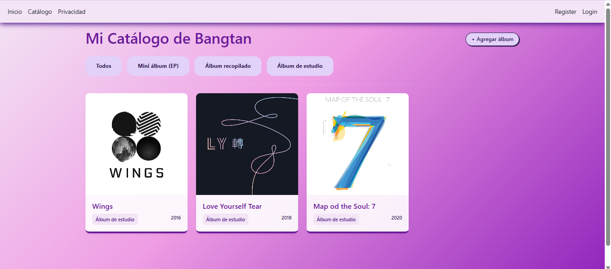
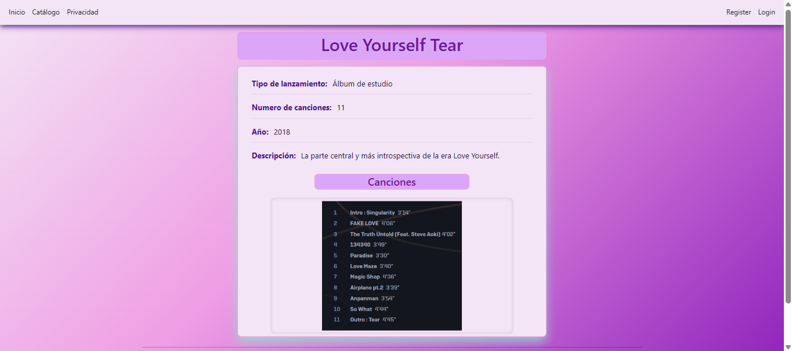
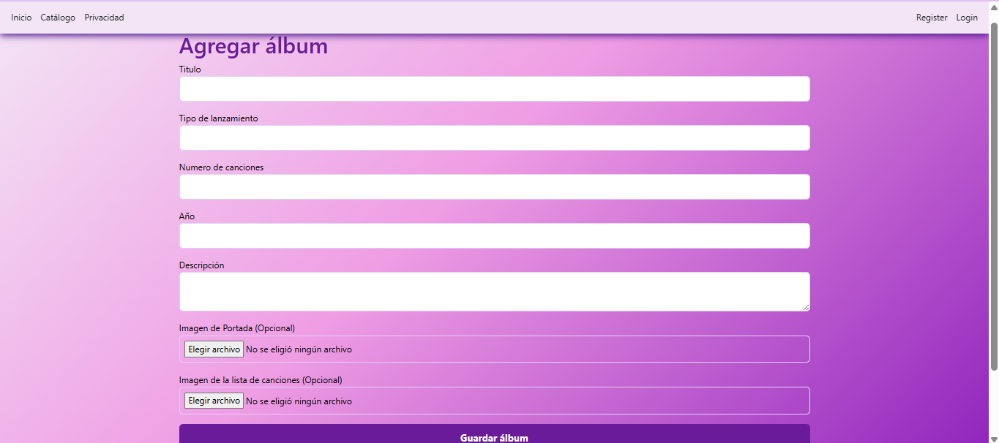

# Tecnológico de Software
## Materia: Fundamentos de álgebra
## 11/11/2025
## Alumno: Astrit Airan Cetzal Cetzal

# 💜 Catálogo de Álbumes de Bangtan (BTS)

Un sistema web desarrollado para gestionar y visualizar una colección musical. Este proyecto fue creado como práctica académica para la materia de Desarrollo de Software, aplicando los fundamentos de la arquitectura Modelo-Vista-Controlador (MVC).

## 📝 Descripción del Proyecto

El sistema permite visualizar un catálogo interactivo con la discografía de BTS. Los usuarios pueden explorar los álbumes, filtrar por tipo de lanzamiento (EP, Álbum de Estudio, Recopilatorio) y acceder a una vista de detalles que muestra información técnica, descripción, portada y lista de canciones (tracklist). 

Además, cuenta con un formulario funcional para registrar nuevos álbumes dinámicamente durante la sesión activa.

## 🛠️ Cómo se construyó (Tecnologías)

Este proyecto fue desarrollado bajo la arquitectura **MVC** utilizando el siguiente Stack Tecnológico:

* **Backend:** C# con el framework ASP.NET Core MVC.
* **Frontend:** HTML5 y CSS3 
* **Almacenamiento:** Memoria Volátil (Caché / RAM). Actualmente no utiliza una base de datos relacional; los datos y archivos multimedia se procesan y almacenan en memoria durante el tiempo de ejecución mediante la conversión de archivos a cadenas de texto **Base64**.

## ✨ Funcionalidades Implementadas

1. **Lectura de Catálogo (Read):** Visualización en formato cuadrícula (Grid) de elementos predefinidos con efectos de animación CSS.
2. **Filtros Dinámicos:** Clasificación de los elementos en tiempo real según su categoría mediante parámetros de ruta en el controlador.
3. **Creación de Registros (Create):** Formulario HTML que acepta entrada de texto y carga de archivos multimedia (`enctype="multipart/form-data"`).
4. **Procesamiento de Archivos (IFormFile):** Conversión de imágenes subidas por el usuario a arreglos de bytes y posteriormente a Base64 para su almacenamiento temporal sin requerir persistencia en el disco duro.
5. **Vistas de Detalle:** Diseño de doble sección para mostrar de manera estructurada los metadatos del álbum y sus respectivas imágenes.

## 📸 Capturas de Pantalla

*(Nota para ti, Astrit: Toma capturas de pantalla de tu proyecto corriendo. Guárdalas en una carpeta llamada `docs` o `imagenes-readme` dentro de tu proyecto. Luego, reemplaza las rutas entre los paréntesis de abajo con el nombre real de tus fotos).*

**Página Principal (Inicio)**

**Catálogo y Filtros**

**Vista de Detalles de un Álbum**

**Formulario de Agregar Álbum**

---

## 🤖 Declaración de uso de Inteligencia Artificial

Para el desarrollo de este proyecto declaro que utilicé asistencia de modelos de Inteligencia Artificial (LLMs) como herramienta de apoyo educativo bajo los siguientes propósitos:
* **Depuración (Debugging):** Análisis de errores de compilación y problemas de enrutamiento en ASP.NET Core.
* **Diseño UI/UX:** Generación de estructuras de estilo CSS avanzadas (Flexbox, Grid, Animaciones `@keyframes`) para mejorar la presentación visual.
* **Refactorización:** Orientación sobre mejores prácticas para el manejo de carga de archivos (conversión a Base64 en memoria) adaptadas al nivel de la asignatura.
El diseño lógico, la estructura de la aplicación y la validación final del código fueron realizados por mi.

## 📄 Derechos de Autor (Copyright)

Copyright (c) 2026 Astrit. Todos los derechos reservados.

Este proyecto y su código fuente fueron desarrollados de manera individual con fines académicos. No se autoriza la copia, reproducción, distribución, modificación o reutilización total ni parcial de este código sin el consentimiento expreso y por escrito de la autora.

## 🤝 Agradecimientos

- **Profesor Jorge Javier Pedrozo Romero** por el apoyo constante.

---

## 📧 Contacto

- **Email Institucional:** [astrit.cetzal@tecdesoftware.edu.mx]
- **GitHub:** [astritcetzal](https://github.com/astritcetzal)

---

**⭐ Si te gustó este proyecto, dale una estrella ⭐**

Hecho con 💗 por [**Astrit Cetzal**] - 2026

